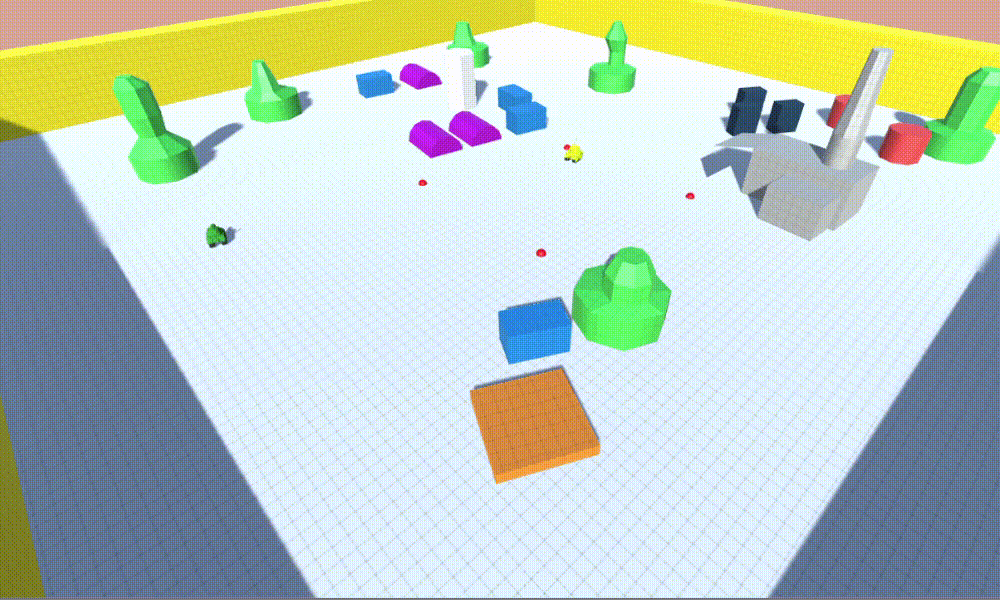

# Artificial Intelligence Samples

A project with some use cases of artificial intelligence techniques implemented in Unity

## Topics

* 01 - Vectors and Moving
* 02 - Pushing The Character Forward
* 03 - WayPoints
* 04 - Unity WayPoints
* 05 - Simple AI Car
* 06 - Unity Vehicle Setup
* 07 - Pathfinding Through Waypoints
* 08 - Navigation Areas Cost
* 09 - NavMesh and Off Links
* 10 - Different NavMesh Agents
* 11 - Crowd Simulation
* 12 - Flee Behaviour
* 13 - Flock Behaviour
* 14 - Line of Sight
* 15 - Finite State Machine
* 16 - Behaviour Trees
* 17 - GOAP

### Instructions

Use "E" key to go to the next scene, and "Q" key to go to the previous scene. Each scene has its own instruction Canvas (if needed)